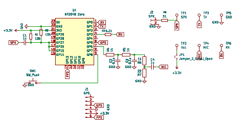
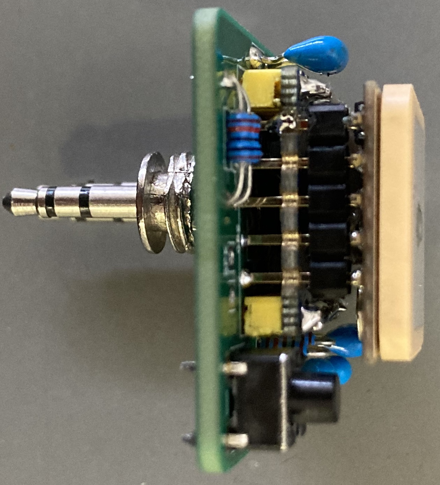
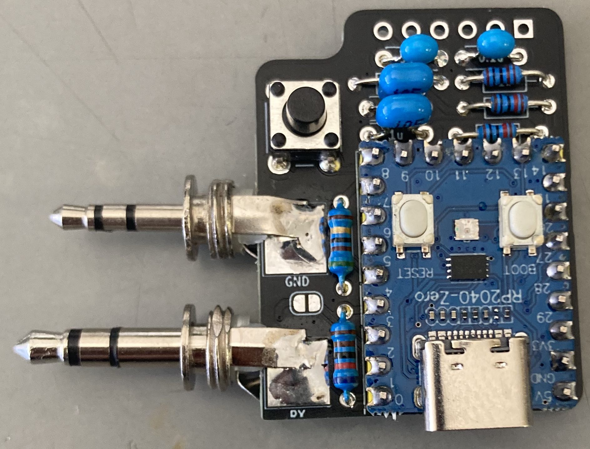

# "C-BOARD (DSP-Board) for UV-K5 (KD8CEC)"用のPC通信ファームウェア

KD8CECの開発したUV-K5用のファームウェアは，アマチュア無線用としてCW, SSTV, FT8などの多くの機能を有するものです.  
残念ながら，2024年6月以降は新しいヴァージョンは発表されていませんが，すでにスタンドアロンでFT8通信も可能となっています(追加のハードウェアが必要).  
KD8CECのblog http://www.hamskey.com/ での最新のファームウェア0.3v http://www.hamskey.com/2024/05/introducing-uv-k5-version-03q-stable.html の説明では，FT8などの運用について書かれています.  

FT8通信を行うには2つの方法が説明されています.  
1つ目は，PCを使用してFT8通信を行う方法です.  
ハードウエア的にはhttp://www.hamskey.com/2024/03/introducing-uv-k5-version-03c-added.html に記載されている"CAT communicationケーブル"（シリアル通信ケーブルに3.5mmのスピーカー出力端子をつけたもの）を作る必要があります.  
これは，PCによるCWキーイングを可能する改造を行った自作も可能です．https://je1rav.blogspot.com/2025/11/uv-k5ft8cw.html  
他にも”Ham Radio All-in-one-Cable; AIOC” https://github.com/skuep/AIOC を使用する方法もあります.  
受信だけなら”C-BOARD (DSP-Board) for UV-K5”を製作して使用することで，UV-K5単体で可能になります.  
詳細はhttp://www.hamskey.com/2024/03/c-board-for-uv-k5.html に記載されています.  
また，最近のOrganisasi Amatir Radio Indonesia (ORARI) (Indonesian Amateur Radio Organization)における”DIY APRS Tracker menggunakan HT UV-K5/K6”なる記事https://orari.or.id/diy-aprs-tracker-menggunakan-ht-uv-k5-k6/ でも紹介されており，KD8CECの作ったファームウェアもダウンロードできるようになっています.  

  
この”C-BOARD (DSP-Board) for UV-K5”を製作し，通信用のファームウエアを作れば”AIOC”の代わりに通信インターフェイスになります.  
ただし，”AIOC”が持っているPCからのオーディオ出力をUV-K5に送る機能はありません.  
また，KD8CECファームウェア上でPCによるCWキーイングも行えるように改造することも可能性です(抵抗1個の追加が必要).  
ついでなので，PCからのオーディオ出力をUV-K5に送ることも計画しました.  
  
と言う訳で新たに改造ボードを作ってみました.  

## ”C-BOARD (DSP-Board) for UV-K5”(mod)の製作  
      
CWキーイング用の抵抗とPCからのオーディオ出力をUV-K5に送るためのLPF回路が追加されています.  
3.5mmジャックと2.5mmジャックの取り付け方法を少し変えた2ヴァージョンを作って見ました.  
①C-BOARD (DSP-Board) for UV-K5と似た構造のもの  
  
PCBのKicadファイルは”kicad/UVK5-C-board-D_kicad.zip”です.  
JLCPCB用ガーバーファイルは”kicad/UVK5-C-board-D_garbar.zip”です.    
  
②AOICと似た構造のもの  
GPSは裏側につけます.  
PCBのKicadファイルは”kicad/UVK5-C-board-E_kicad.zip”です.  
JLCPCB用ガーバーファイルは”kicad/UVK5-C-board-E_garbar.zip”です.  
詳細はBlog をご覧ください.  

### 必要部品  
	RP2040 Zero 1個  
	GP-02-Kit モジュール 1個（必要ならば）  
	3.5mm 3Pole オーディオジャック 1個  
	2.5mm 3Pole オーディオジャック 1個  
	積層コンデンサー1uF 1個  
	抵抗 10kΩ 2個（オリジナルと同様に1N4148 2個でも可）  
	抵抗 51Ω 1個（必要ならば，外部スピーカー接続用）  
	小型スピーカー 1個（必要ならば，外部スピーカー接続用）  
	タクトスイッチ 1個（必要ならば，通信用ファームでのモード切り替え用）  
	抵抗 6.2kΩ 1個（必要ならば，KD8CECでのCWキーイング用）  
	抵抗 1kΩ 3個（Firmware-IJVでのFT8送信用）  
	抵抗 22Ω 1個（Firmware-IJVでのFT8送信用）  
	積層コンデンサー0.1uF 2個 （Firmware-IJVでのFT8送信用）  
	積層コンデンサー1uF 1個 （Firmware-IJVでのFT8送信用）  

## 通信用ファームウェア(for KD8CEC ver0.3v)
KD8CECのUV-K5用ファームウェア0.3vでは，DIGモードをONにすると3.5mmオーディオジャックの根本のピンはシリアル通信用になり，DIGモードをOFFにした場合には基本的にPTT用となります.  
このとき，GND接続で送信になり，CWモードでは，このピンの電圧を検出して外部キーイングを行なっています.  
このため，0.3vでCWストレートキーモードに設定すれば，このピンにPCからキーのON/OFF信号を送ることで．キーイングが可能になります.  

  
KD8CECのUV-K5用ファームウェア0.3vでFT8用の機能とPCによるCWキーイングを実現するにはUSBシリアルポート3個（UV-K5とのUSB-UARTブリッジ，GP-02-KitとのUSB-UARTブリッジ，シリアルポートを使ったCWキーイング）とUSB Audio(Audio Source)が必要です.  
pico-sdkとtinyUSBを使ってプログラム開発を行えば，これも可能かと思います.  
しかし，Arduino ide開発環境で簡便に開発しようと考えた場合，現時点(November 2025)では制限がいくつかありますので，タクトスイッチで作動モードを切り替えることにしました.  

という訳で  
### Arduino-picoボードマネジャー版
Arduino-picoをボードマネジャーとして使用し，USBスタックとして”Adafruit TinyUSB for Arduino"を使用することを考えたのですが，現時点では正式版ではUSB Audioはサポートされていません.  
これについては，pschatzmannがUSB Audioへの拡張https://github.com/pschatzmann/Adafruit_TinyUSB_Arduino/tree/Audio を行なっており，これを使用すればUSB Audioが使えます.  
上記githubをzipファイルでダウンロードし，Arduino ide開発環境でライブラリーとして追加すれば元のライブラリーに替わってこちらが使用できます.  
しかし，まだ制限があります．元々の”Adafruit TinyUSB for Arduino"ライブラリーではUSBシリアル通信として2ポートまでの使用が可能です.  
しかし，pschatzmann氏のUSB Audioの拡張版では，USB Audioのマイクロフォン(Audio Sourceのみ)を使用する場合，USBシリアル通信は1ポートのみが想定されているようで，シリアル通信2ポート+USB Audio Sourceは使えませんでした.  
一方, ヘッドセット（USB Audio SourceとUSB Audio Sinkの同時使用）にすると，シリアル通信に2ポートが使えました.  
しかし残念なことに，このヘッドセットの場合には，WindowsではUSB Audioデバイスを正しく認識せずにエラーが出て使えません（MacOSでは使用可能，多分LinuxでもOK）.  
これは，ライブラリーのAdafruit_USBD_CDC.cppの一部を少し書き換えればWindowsでも正しく認識されるようになります.  
この部分だけを修正したライブラリーがhttps://github.com/je1rav/Adafruit_TinyUSB_Arduino/tree/je1rav-patch にあります.  
Libraryマネージャーでzip形式でダウンロードしたhttps://github.com/je1rav/Adafruit_TinyUSB_Arduino/tree/je1rav-patch を加えてください.  

このファームウェアでのモードは，　  
①FT8通信時：USBシリアル通信2ポート(UARTブリッジ UV-K5　＆　UARTブリッジ GPS) + USB Audio (Source&Sink)：青色LED，GPS受信完了時には緑点滅，送信時赤色     
②CW通信時：USBシリアル通信1ポート(CWキーイング) + USB Audio (Source&Sink)：緑色LED，送信時赤色     
の2つです.  
PCには，Source(マイクロホン)とSink（ヘッドフォン）が現れますが，Sink（ヘッドフォン）は何もしません.  
タクトスイッチでモードを切り替えると，RP2040はリセットされます.  
ソースコードは""です.  
Uf2バイナリーは””です.  

  
”C-BOARD (DSP-Board) for UV-K5”とこの”AIOC”もどきの通信ファームウェアを一枚のボードで実現したい場合には、その都度uf2ファイルを書き込んで使用するのが簡単です.  

  
### ②のCWキーイングを行う場合のオリジナル”C-BOARD (DSP-Board) for UV-K5”のハードウエア改造部分  
モード切り替えはGP8ピンを一時的にGNDに繋ぐことで可能.  
V-K5側でDIGモードをOFFに切り替える必要があります.  
KD8CECのUV-K5用ファームウェア0.3vではCW通信時には,DIGモードをOFFにしてURAT用端子の電圧をモニターしてキー操作を検出します.  
外部パドルを使った時の左キーON, 右キーON, 両キーONのどれになっているかを検出するための電圧がUV-K5用ファームウェア内で設定可能です.  
http://www.hamskey.com/2024/01/introducing-uv-k5-version-01p-cw.html を見ると，ストレートキーの場合には10kΩの抵抗でUV-K5のMCUの電源ライン(3.3V)に繋げてONになるように設定しているようです.  
簡便な方法としてはRP2040のPIO出力を抵抗を介してPTT端子に接続することが考えられます.  
実際にGPIO出力を10kΩ抵抗を介してPTT端子に接続したところうまく作動せず，6.2kΩ程度でON/OFF可能でした.  
GPIO-3ピンが該当ピンですので，PTT端子に接続しているGPIO-0ピンとの間に6.2kΩ程度の抵抗を繋げてください.  
この抵抗の最適値は実際に試して決める必要があるかもしれません.  

## 通信用ファームウェア(for Firmware-IJV)
Firmware-IJVでは，3.5mmオーディオジャックの根本のピンはシリアル通信用とPTT用の共用で，GND接続で送信になります.  
このピンにPCからキーのON/OFF信号を送ればPTT操作やCWキーイングが可能になります.  
また，PCからのUSB Audio信号をUV-K5のマイク端子に入力しますので，LPFが必須です.  

という訳で  
### Arduino-picoボードマネジャー版
Firmware-IJVのDSBモードでFT8用の機能とPCによるCWキーイングを実現するにはUSBシリアルポートとUSB Audio(Audio Source & Sink)が必要です.  
Arduino ide開発環境でArduino-picoをボードマネジャーとして使用して簡便に開発しようと考えた場合，現時点(November 2025)では制限がいくつかあります.  
まず，USBスタックとしてUSB Audioサポート拡張版”Adafruit TinyUSB for Arduino"が必要です.  
これは，pschatzmannのhttps://github.com/pschatzmann/Adafruit_TinyUSB_Arduino/tree/Audio です.  
しかし，pschatzmann氏のUSB Audioの拡張版では，ヘッドセット（USB Audio SourceとUSB Audio Sinkの同時使用）を使用すると，WindowsでUSB Audioデバイスを正しく認識せずにエラーが出て使えません（MacOSでは使用可能，多分LinuxでもOK）.  
これは，ライブラリーのAdafruit_USBD_CDC.cppの一部を少し書き換えればWindowsでも正しく認識されるようになります.  
この部分だけを修正したライブラリーがhttps://github.com/je1rav/Adafruit_TinyUSB_Arduino/tree/je1rav-patch にあります.  

このファームウェアでのモードは，　  
①FT8通信時：USBシリアル通信1ポート(UARTブリッジ GPS) + USB Audio (Source & Sink)：青色LED，GPS受信完了時には緑点滅，送信時赤色     
②CW通信時：USBシリアル通信1ポート(CWキーイング) + USB Audio (Source)：緑色LED，送信時赤色     
の2つです.  
PCには，Source(マイクロホン)とSink（ヘッドフォン）が現れます.  
タクトスイッチでモードを切り替えると，RP2040はリセットされます.  
ソースコードは""です.  
Uf2バイナリーは””です.  

このUSB Audioの拡張版TinyUSBスタックで受信（USB Audio Source）は問題なく作動したのですが，送信（USB Audio Sink）をうまく作動させることができませんでした.  
UBSの1mS毎の1パケット内では問題なさそうなのですが，パケット毎のつなぎ目付近でおかしくなっているようで，信号が大きく歪み使用できませんでした.  
このため，送信については以下のようにして回避しました.  
1．各パケット内で信号の周波数を測定し，10パケット分を平均することで，音響信号の周波数を決定しました.  
2．この方法では，約1500Hz程度以上の音響信号の周波数決定ができます（1000Hz以下の低周波数は原理的に不可）.  
3．実際にFT8でデコードできるデータを生成するには2800Hz程度以上が必要でした.  
4．測定した周波数を2000Hz低周波数側にシフトさせ，それをpschatzmann氏の"arduino-audio-tools"を使ってPWMによるサイン波として発生させました.  
5．PC側で2800Hzから3500Hzで送信し，実際には800Hzから1500Hzのトーンを発生させ，UV-K5にマイク入力し，F2Dで送信します.  
6．PC側で2800Hz未満あるいは3500Hz以上で送信しようとしても，実際には送信されません.  
7．このため自動的に日本でのバンドプラン（狭帯域の全電波形式，帯域幅<3kHz）を遵守できます.  

送受信切り替えはFT8CNでも使用できるようにVOX制御にしました（Androidでは単一機器のUSBオーディオ・USBシリアル複合デバイスではUSBシリアルを自動認識しない）.  
PC側から見るとVOXですが，UV-K5側から見ると送信時には外部PTTスイッチが押された形になっています（UV-K5はスケルチが開いているとVOXが作動しない．）.  

リモートCW用モードでは，USBシリアル通信1ポート(CWキーイング用）とUSB Audioを使っています.  
このUSBシリアルポートの"DTR"信号をCWキーイングに使用します.  
FLDIGやDigitalSoundCWなどを使用する場合，アプリ内でこの設定が必要です.  

### ArduinoCore-mbedボードマネジャー版
Firmware-IJVのDSBモードでFT8用の機能とPCによるCWキーイングを実現するにはUSBシリアルポートとUSB Audio(Audio Source　&　sink)が必要です.  

このファームウェアでのモードは，　  
①FT8通信時：USBシリアル通信1ポート(UARTブリッジ GPS) + USB Audio (Source　&　Sink)：青色LED，GPS受信完了時には緑点滅   
②CW通信時：USBシリアル通信1ポート(CWキーイング) + USB Audio (Source　&　Sink)：緑色LED，送信時赤色     
の2つです.  
PCには，Source(マイクロホン)とSink（ヘッドフォン）が現れます.  
タクトスイッチでモードを切り替えると，RP2040はリセットされます.  
ソースコードは""です.  
Uf2バイナリーは””です.  
"Adafruit NeoPixel Library"のversionが新しすぎるとコンパイルエラーが出ます(1.15.0までは動きます).   

この場合には音響通信に関しては送受信で大きな問題は生じませんでしたので，送信時にはPCからの音響データをそのままPWMで出力しています.  
F2Dでの送信なので，日本で運用する場合にはバンドプランの遵守に注意してください.  
（通常のFT8通信は”狭帯域の全電波形式; A3E以外は3kHz以下”が許される周波数で運用されています．F2Dの帯域幅は音響周波数x2ですので音響信号が1500Hz以下でなければダメです．）  

送受信切り替えはFT8CNでも使用できるようにVOX制御です（Androidでは単一機器のUSBオーディオ・USBシリアル複合デバイスではUSBシリアルを自動認識しない）.    
PCなどのホスト側から見るとVOXで，UV-K5側から見ると送信時には外部PTTスイッチが押された形になっています（UV-K5はスケルチが開いているとVOXが作動しない）.  

リモートCW用モードでは，USBシリアル通信1ポート(CWキーイング用）とUSB Audioを使っています.  
このUSBシリアルポートの"DTR"信号をCWキーイングに使用します.  
FLDIGやDigitalSoundCWなどを使用する場合，アプリ内でこの設定が必要です.  

